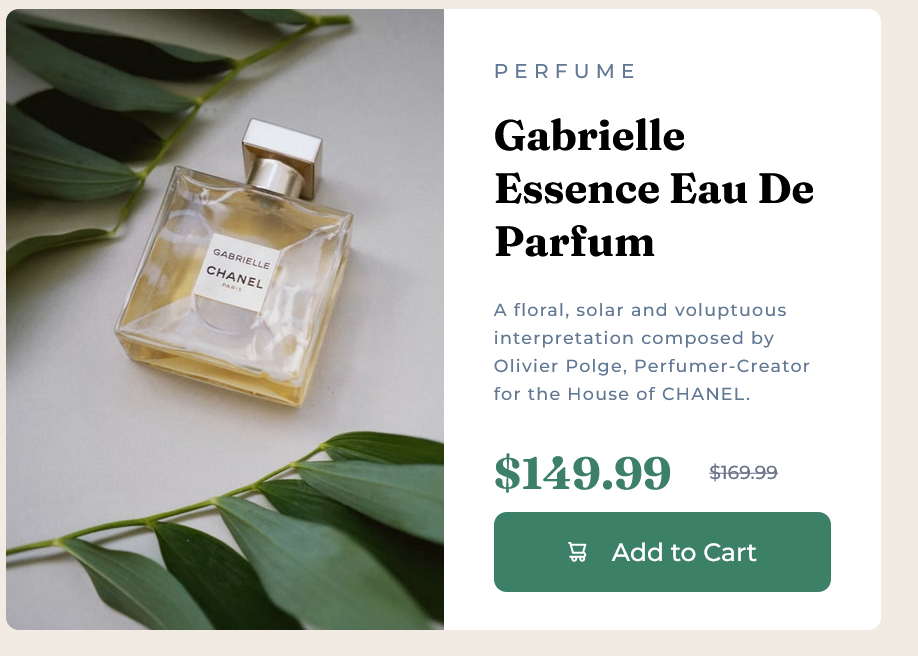
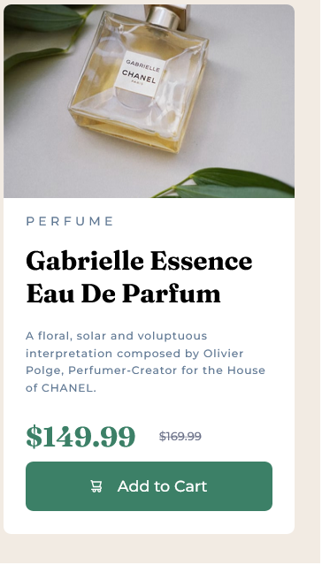

# Frontend Mentor - Product preview card component solution

This is a solution to the [Product preview card component challenge on Frontend Mentor](https://www.frontendmentor.io/challenges/product-preview-card-component-GO7UmttRfa). Frontend Mentor challenges help you improve your coding skills by building realistic projects. 

## Table of contents

- [Overview](#overview)
  - [The challenge](#the-challenge)
  - [Screenshot](#screenshot)
  - [Links](#links)
- [My process](#my-process)
  - [Built with](#built-with)
  - [What I learned](#what-i-learned)
  - [Continued development](#continued-development)
  - [Useful resources](#useful-resources)
- [Author](#author)
- [Acknowledgments](#acknowledgments)


## Overview

### The challenge

Users should be able to:

- View the optimal layout depending on their device's screen size
- See hover and focus states for interactive elements

### Screenshot




### Links

- Solution URL: [GitHub](https://github.com/Franche020/product-preview-card-component-main/)
- Live Site URL: [GitHub Pages](https://franche020.github.io/product-preview-card-component-main/)

## My process

### Built with

- VS Code
- Responsively
- Mozilla Firefox Developers editor
- Semantic HTML5 markup
- CSS custom properties
- Flexbox
- SASS
- Mobile-first workflow


### What I learned

I learned how to design cards based on just images and to do it responsively, also I practiced with flexbox, css and how to set-up gulp-sass environment in vscode, here is de build in CSS with used media query's. To implement media query in SASS I used the mixin's feature.


```css
.card {
  border-radius: 1rem;
  background-color: hsl(0deg, 0%, 100%);
  width: 37.5rem;
}
@media (min-width: 37.5rem) {
  .card {
    width: 70rem;
    display: flex;
    direction: column;
  }
}

.contenedor {
  max-width: 85%;
  margin: 0 auto;
}
@media (min-width: 37.5rem) {
  .contenedor {
    margin: 0 4rem 0 4rem;
  }
}
.imagen {
  background-image: url(../../images/image-product-mobile.jpg);
  background-size: 100%;
  background-repeat: no-repeat;
  background-position: center;
  min-width: 100%;
  min-height: 25rem;
  border-radius: 1rem 1rem 0 0;
  margin: 0;
}
@media (min-width: 37.5rem) {
  .imagen {
    background-image: url(../../images/image-product-desktop.jpg);
    min-width: 50%;
    border-radius: 1rem 0 0 1rem;
  }
}
.header h1 {
  font-family: "Fraunces", serif;
}
@media (min-width: 37.5rem) {
  .header {
    margin-top: 4rem;
  }
}
```
### Continued development

I need to improve my habilities to start a gulp-sass environment because at first it takes time to do

### Useful resources

- [Udemy Course (in spanish)](https://www.udemy.com/course/desarrollo-web-completo-con-html5-css3-js-php-y-mysql/) - Im studying this Udemy course and I learn really a lot

## Author

- Website (now on GitHub) - [Francisco J Casado](https://github.com/Franche020)
- Frontend Mentor - [@Franche020](https://www.frontendmentor.io/profile/Franche020)
